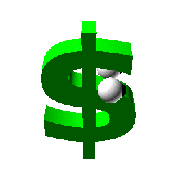
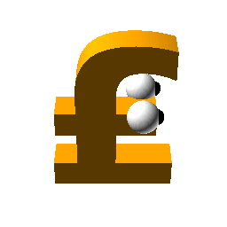
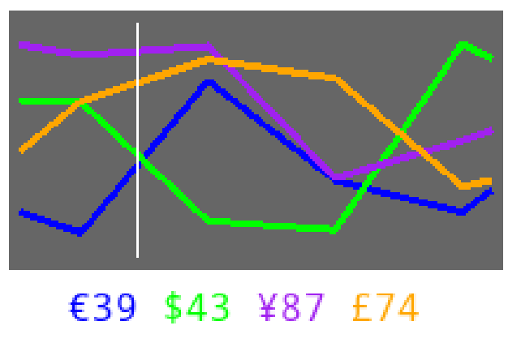

# Ludum Dare 44: Cash Clash

Created for Ludum Dare 44 ("Your life is currency").

## Concept

*Cash Clash* is a local multiplayer top-down arena shooter game where you directly take control over a currency.

Your goal is to fight other currencies while keeping an eye on the current currency strength, an important component of the game.

The strength of a currency constantly varies between the values 0 and 100, impacting the strength of your currency in the arena.

### Game Mechanics

You and other currencies move around in an arena, firing bullets and dodging enemy projectiles. Besides regular movement, you can also utilize a dash skill to surprise your opponent.

The strength of your weapons and your own armor scales in real time with the currency strength. The current timepoint is highlighted with a white vertical line and you can see some seconds into the future to plan your next strategic steps.

It is also possible to change your currency. This is possible in one of the exchange stops which are spread over the map. When you switch to a better currency, you will loose health (but gain weapon strength and armor) - switching to a worse currency will increase your health but lower your strength and armor. But keep in mind that the currencies values keep changing! However, you will keep the health you gained.

### Available Weapons

There are three freely changeable weapon types

| Name        | Fire rate           | Range  | Damage |
| ------------- |:-------------:|:-----:|:-----:|
| Minigun | high | low | low |
| Laser | medium | infinite | medium |
| Crossbow | very low | infinite | very high |

## Controls

The game contains three player characters, each of them can be controlled either by a human player or an (not very intelligent) AI.

### Human players

#### Player 1
* Movement: W, A, S, D
* Aim: Relative mouse position
* Shoot: Left mouse button
* Dash: Right mouse button
* Change weapon: Tab

#### Player 2 and 3

Both of them expect controller input signals.

* Movement: Controller left stick
* Aim: Controller right stick
* Shoot: **TODO**
* Dash: **TODO**
* Change weapon: **TODO**

## Installation

We provide binaries for windows and linux-based systems.

**TODO**: HTML5??

## Contributors

This project was created within 72 hours by [jcklie](https://ldjam.com/users/jcklie/), [mburgert](https://ldjam.com/users/mbugert/) and [tomatenbrei](https://ldjam.com/users/tomatenbrei/).

