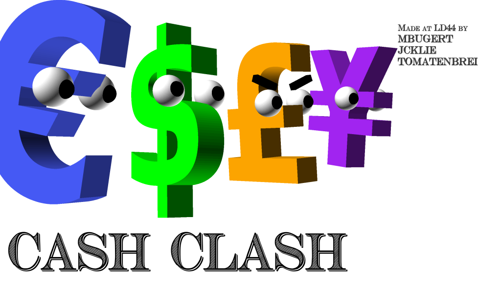

# Ludum Dare 44: Cash Clash

A game created for Ludum Dare 44 under the theme "Your life is currency".

## Concept

*Cash Clash* is a local multiplayer top-down arena shooter game where you directly take control over a currency.

Your goal is to fight other currencies while keeping an eye on the current currency strength, an important component of the game. This strength is visualized in a line chart as follows.

The strength of a currency constantly varies between the values 0 and 100 and directly impacts the prowess of your player character in the arena.

### Game Mechanics

You and other currencies move around in an arena, firing bullets and dodging enemy projectiles. Besides regular movement, you can also utilize a dash skill to surprise your opponent.

The strength of your weapons and your own armor scales in real time with the currency strength. The current timepoint is highlighted with a white vertical line and you can see some seconds into the future to plan your next strategic steps.

It is also possible to change your currency. This is possible in one of the exchange stops which are spread over the map. When you switch to a better currency, you will loose health (but gain weapon strength and armor) - switching to a worse currency will increase your health but lower your strength and armor. But keep in mind that the currencies values keep changing! However, you will keep the health you gained.

The game always uses three player characters, each playing as an individual currency. In the main menu, you can define how many of them are controlled by humans. You can only change to other currencies which are not already taken by other players.

***Hint: When you play the game for the first time, you should definitely start it in three players mode** - even when you want to play alone. The AI is quite powerful and would most likely frustrate you when you directly fight against it. In your next rounds, you can decrease the number of human players to two such that the AI takes over a single player character. If you feel prepared enough after some training, you can switch to the true single player mode.*

### Available Weapons

There are three freely changeable weapon types. Their basic properties are listed below.

| Name        | Fire rate           | Range  | Damage |
| ------------- |:-------------:|:-----:|:-----:|
| Minigun | high | low | low |
| Laser | medium | infinite | medium |
| Crossbow | very low | infinite | very high |

## Controls

The game contains three player characters, each of them can be controlled either by a human player or an (not very intelligent) AI.

### Human players

#### Player 1
* Movement: W, A, S, D
* Aim: Relative mouse position
* Shoot: Left mouse button
* Dash: Right mouse button
* Change weapon: Tab

#### Player 2 and 3

Both of them expect controller input signals.

* Movement: Controller left stick
* Aim: Controller right stick
* Shoot: R2
* Dash: L1, R1
* Change weapon: L2

## Used technologies and resources

The game was created with the [godot engine](https://godotengine.org/).

**Additional utilized software solutions**

* [Inkscape](https://inkscape.org/de/) for the splash screen
* [Gimp](https://www.gimp24.de/) for backgrounds / simple graphic modifications
* [Piskel](https://www.piskelapp.com/) for very simple tile graphics
* [OpenSCAD](https://www.openscad.org/downloads.html) to generate the player and cash exchange station graphics
* [Abletron Live 10](https://www.ableton.com/en/live/) for sound effect creation

## Used third-party assets

**Sounds**

* [Cash register sample](https://freesound.org/people/kiddpark/sounds/201159/)

**Fonts**

* [Noto Mono](https://www.google.com/get/noto/)
* [Cash Currency Font](https://www.dafont.com/cash-currency.font)

## Contributors

This project was created within 72 hours by [jcklie](https://ldjam.com/users/jcklie/), [mburgert](https://ldjam.com/users/mbugert/) and [tomatenbrei](https://ldjam.com/users/tomatenbrei/).

